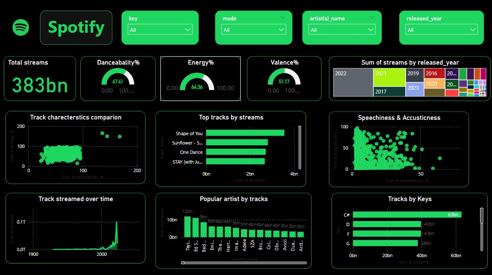

# Spotify Power BI Dashboard 🎧📊

This project is a Power BI dashboard created using Spotify's 2023 track dataset. The dashboard provides rich visual insights into the most streamed tracks, artists, and musical characteristics on Spotify.

## 📁 Dataset

- File: `spotify-2023.csv`
- Source: Spotify 2023 data (assumed public dataset)
- Contents: Includes information such as track name, artist, streams, energy, danceability, valence, key, and other audio features.

## 📊 Dashboard Features

The Power BI dashboard includes the following visuals:

- 🔢 **Total Streams**: Total number of streams (383 billion+).
- 💃 **Danceability, Energy, Valence Gauges**: Average audio characteristics of top tracks.
- 📅 **Streams by Release Year**: Heatmap by year.
- 🔥 **Top Tracks by Streams**: E.g., "Shape of You", "One Dance", "Sunflower".
- 🎙️ **Speechiness & Acousticness Correlation**
- ⏳ **Track Streams Over Time**: Historical stream trends.
- 🌟 **Popular Artists by Track Streams**: Taylor Swift, Bad Bunny, Ed Sheeran, etc.
- 🎼 **Tracks by Key**: Visualizing which musical keys are most popular.

## 🛠️ Tools Used

- Microsoft Power BI
- CSV Dataset
- Custom DAX Measures and Visuals

## 📷 Dashboard Screenshot

## 🚀 How to Use

1. Clone this repo
2. Open the `.pbix` file (if available) in Power BI Desktop
3. Import `spotify-2023.csv` as your data source
4. Refresh the data and explore the visualizations

## 🙌 Credits

Dashboard created by Kishore Seenappa.
